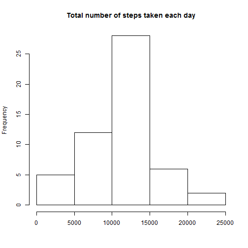
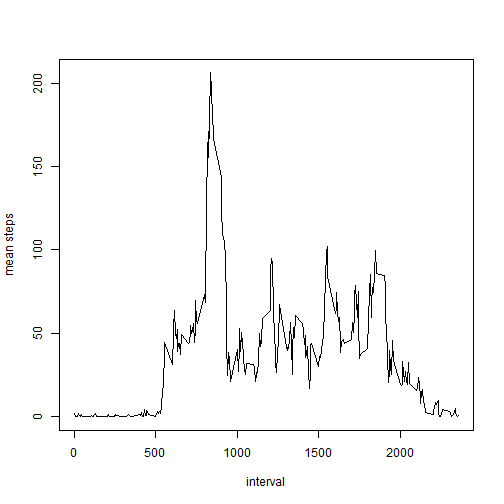
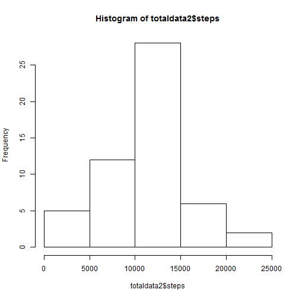
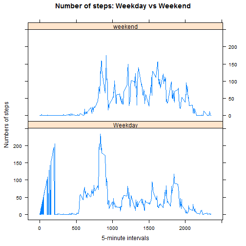

## This is the peer assesement 1 for Reproducible Research  

## Loading and preprocessing the data


```r
if(!file.exists("Activity.zip")){
  
  fileUrl <- "https://d396qusza40orc.cloudfront.net/repdata%2Fdata%2Factivity.zip"
  download.file(fileUrl,destfile="Activity.zip")}

unzip("Activity.zip")

data <- read.csv('activity.csv')
```

### loading library dplyr, ggplot2 and sqldf


```r
library(dplyr)
library(ggplot2)
library(sqldf)
```


## calculate and plot total number of steps taken per day


```r
datanona<-na.omit(data)
data1<-sqldf("select sum(steps) as ttl from datanona group by date")
```

```
## Loading required package: tcltk
```

```r
hist(data1$ttl,main="Total number of steps taken each day", xlab="")
```

 


## What is mean total number of steps taken per day?

```r
mean(data1$ttl,na.rm=TRUE)
```

```
## [1] 10766.19
```

```r
median(data1$ttl,na.rm=TRUE)
```

```
## [1] 10765
```


## What is the average daily activity pattern?

1. Time series plot of the 5-minute interval(x-axis) and the average number of steps taken, averaged across all days (y-axis)


```r
data2<-sqldf("select avg(steps) as mstep, interval from data group by interval")

plot(mstep ~ interval, data = data2, type = "l",ylab="mean steps")
```

 

2. Which 5-minute interval, on average across all the days in the dataset, contains the maximum number of steps?


```r
data2[which.max(data2$mstep), ]$interval
```

```
## [1] 835
```


## Inputing missing values

*1. Calculate and report the total number of missing values in the dataset (i.e. the total number of rows with NAs)*


```r
sum(is.na(data$steps))
```

```
## [1] 2304
```

*2. Devise a strategy for filling in all of the missing values in the dataset.*


```r
intervalSteps <- function(interval) {
    data2[data2$interval == interval, ]$mstep
}
```

*3. Create a new dataset*


```r
dataupdated<-data

i = 0

for (i in 1:nrow(dataupdated)){
  if(is.na(dataupdated[i,]$steps)){
    dataupdated[i,]<-intervalSteps(dataupdated[i,]$interval)
    i=i+1
      
  }
}

cat("Total",i,"NA values were inputted.")
```

```
## Total 17569 NA values were inputted.
```

*4.Histogram and comparing new mean and median*


```r
totaldata2<-aggregate(steps~date,data=dataupdated,sum)
hist(totaldata2$steps)
```

 

```r
mean(totaldata2$steps,na.rm=TRUE)
```

```
## [1] 10766.19
```

```r
median(totaldata2$steps,na.rm=TRUE)
```

```
## [1] 10765
```

*Conclusion: There is no difference in the estimates from the first part. It is due the the strategy used for filling the NAs*


## Are there differences in activity patterns between weekdays and weekends?

Create a new factor variable in the dataset with two levels - "weekday" and "weekend" indicating whether a given date is a weekday or weekend day.


```r
dataupdated$date<-as.Date(dataupdated$date)
day<-weekdays(dataupdated$date)
daywe<-ifelse(day %in% c("Sunday","Saturday"),"weekend","Weekday")

dataupdated$day <-daywe 
```

Make a panel plot 


```r
library(lattice)
stepsInterval2<-aggregate(steps~interval+daywe,data=dataupdated,mean)

xyplot(steps~interval|daywe,data=stepsInterval2,type="l",main="Number of steps: Weekday vs Weekend", xlab="5-minute intervals",ylab="Numbers of steps",layout=c(1,2))
```

 

